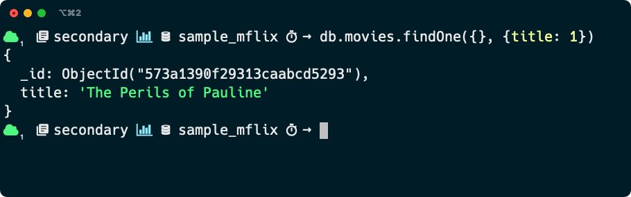

# Dockerized MongoDB Shell (unofficial)

This repo contains the image definition for a dockerized version of the MongoDB Shell (`mongosh`).

It includes all bells and whistles with prompt personalization with a custom [`.mongoshrc.js`](./mongoshrc.js).



## How do use it

For the best experience, use a terminal configured to use [Nerd Fonts](https://github.com/ryanoasis/nerd-fonts).

 * Checkout this repo
 * Build the image with `docker build . -t mmarcon/mongosh`
 * Run it with `docker run -i -t mmarcon/mongosh <mongodb connection string>`

### Set up a Docker volume to have access to the host's filesystem

If your shell scripts or commands need to write to disk, you can set up [a volume](https://docs.docker.com/storage/volumes/)
that points to your local filesystem.

You can do that with something like this:

```bash
$ docker run -i -t --volume `pwd`:/cwd mmarcon/mongosh <mongodb connection string>
```

With that, anything `mongosh` will write to disk at path `/cwd` will and up in your current working directory.